#         State Comparator

## TEAM MEMBERS
    * Regina Tettey
    * Vera Song
    * Jannette Amedome
    * Nicholas Koranteng
    * Sylvester Okeleke
    * Meakin Marange
  
## Hypothesis 
   ### Not all states are equal.
 

 ## Objective
To use Data analytics tools, in particular, pandas, matplotlib and others to help consumers visually compare states in the following categeries

 a) Personal Income and personal expenditure per capita in two states
 
 b) Finding outstanding states since 1997
 
 c) Project average personal income and expenditure
 
 d) Public transport use and personal expenditure on public transport 

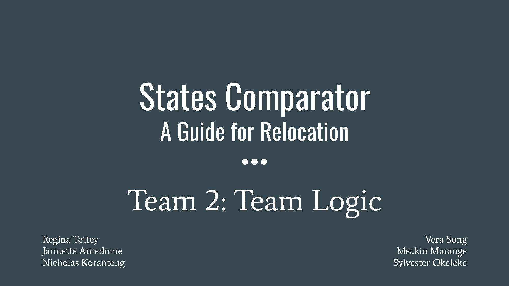
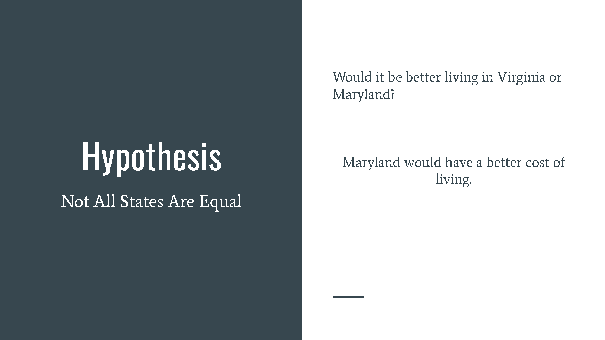
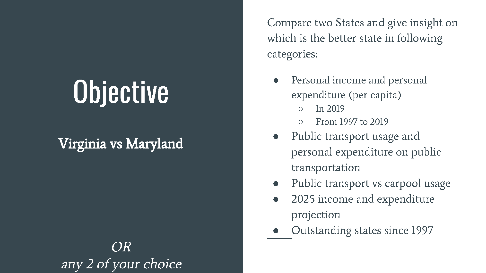
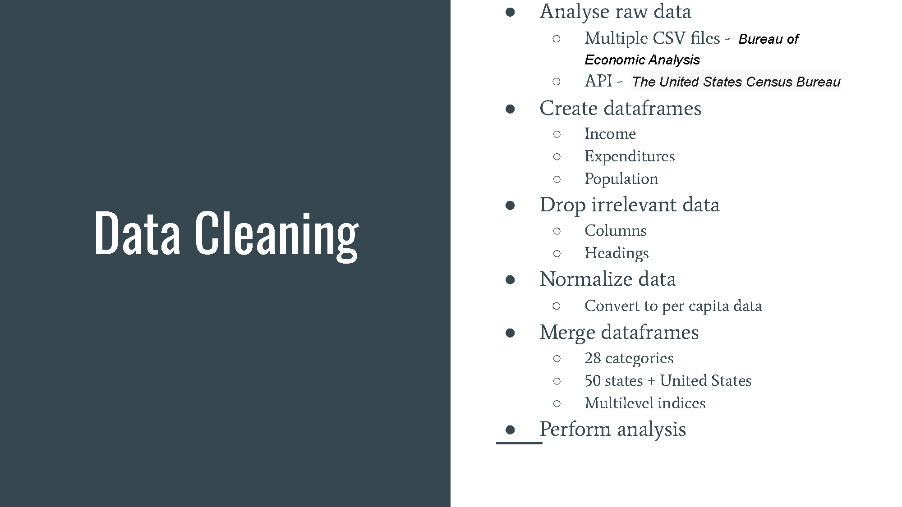
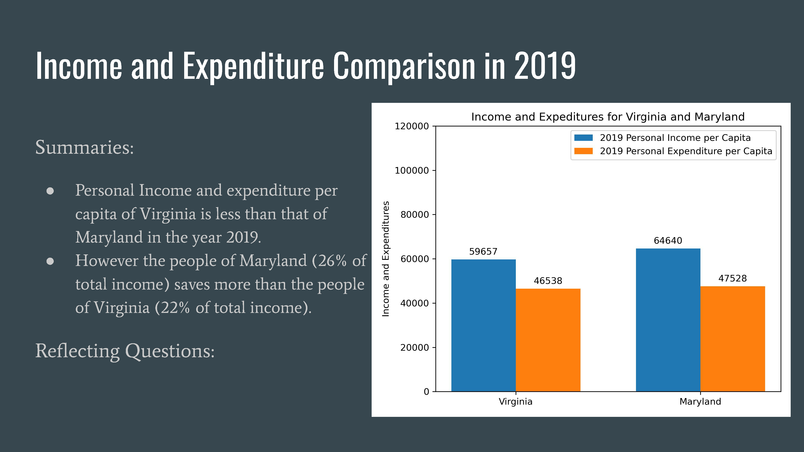
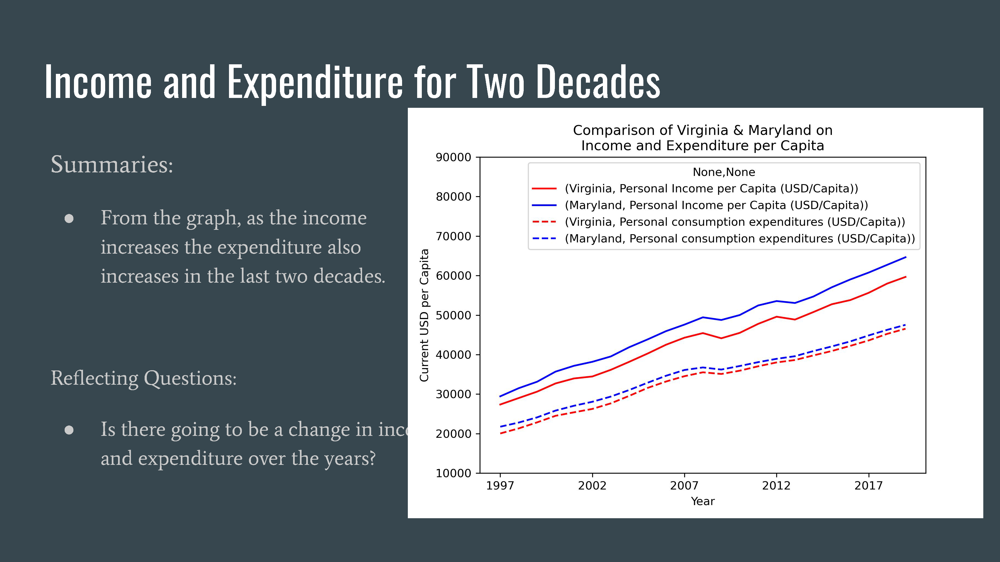

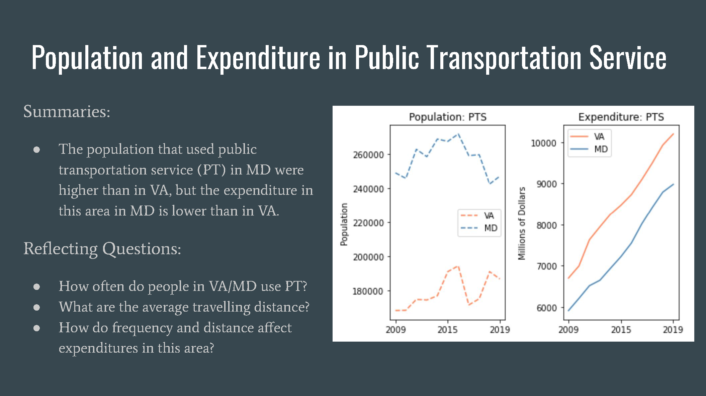
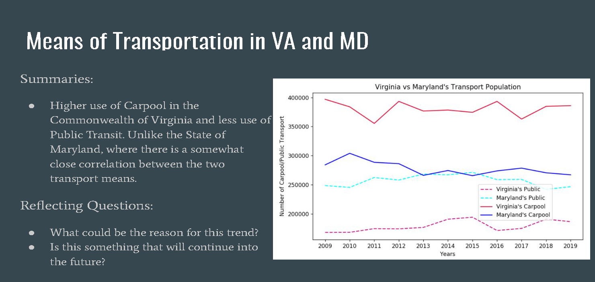
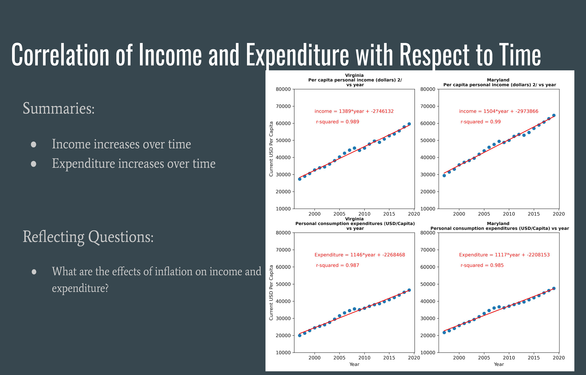
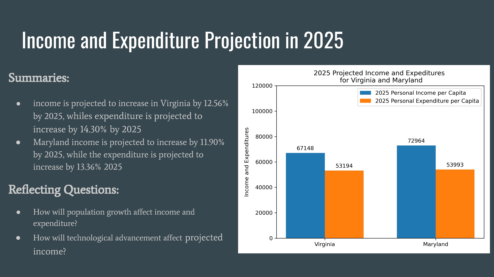
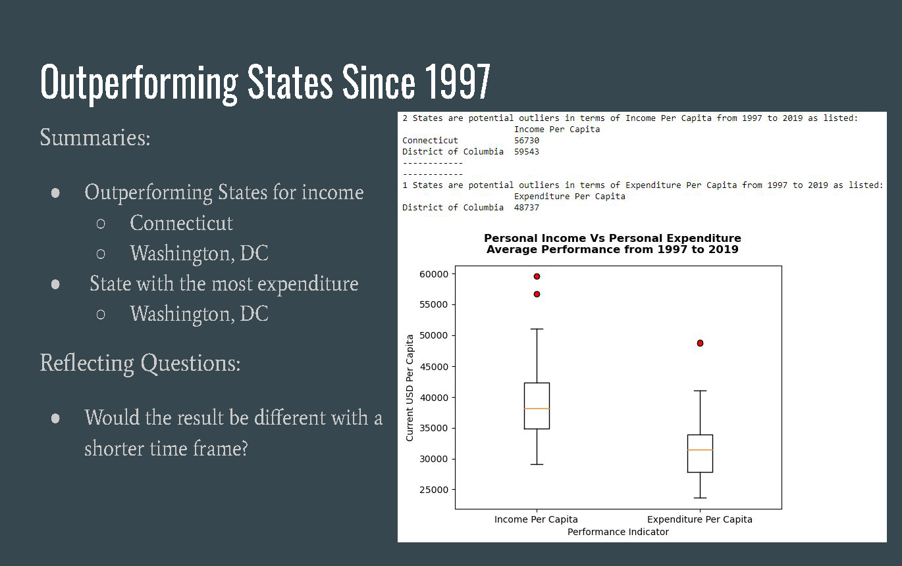
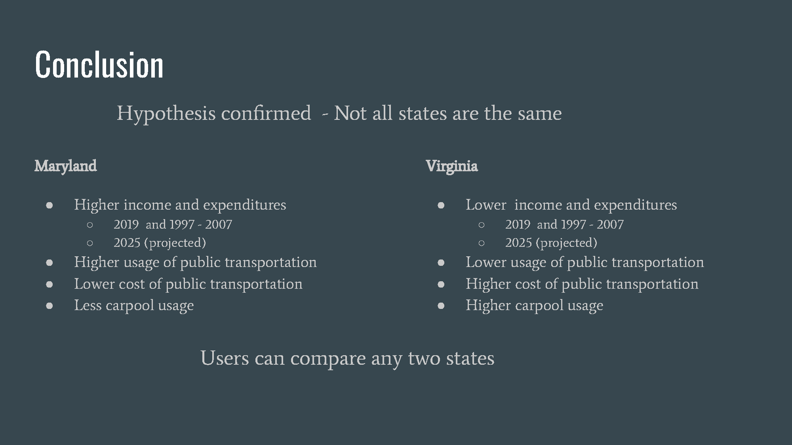
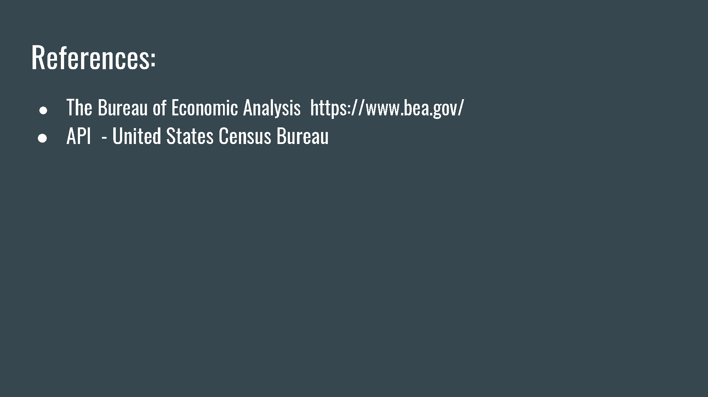

